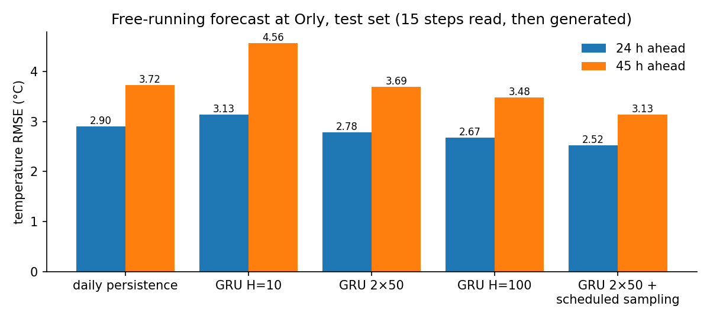

# Recurrent neural networks for weather forecasting

Deep learning lab in PyTorch: from the mechanics of RNN, GRU and LSTM cells to forecasting real weather measurements taken every 3 hours at Orly airport, and a training method that makes multi-step forecasts robust to their own errors.



## Highlights

- **RNN, GRU and LSTM compared** on shapes, states and parameter counts (27, 81 and 108 parameters for the same sizes).
- **Careful data preparation**: 7 SYNOP variables normalized with training statistics only, sliding windows that skip measurement gaps, and a chronological validation split.
- **Next-step forecast (3 h)**: a small GRU reduces the error by about 35% compared with persistence, mostly on the daily cycles of temperature and humidity.
- **Multi-step forecasting**: with teacher forcing, a small model does worse than simply repeating the last observed day from 24 h onwards; more capacity is needed to beat it.
- **Scheduled sampling with backpropagation through the generation** cuts the free-running error by 15% at equal architecture: **2.5 °C** temperature error at 24 h and **3.1 °C** at 45 h, the best result of the lab.

## Contents

- Background on simple RNNs, unfolding in time, GRU and LSTM equations
- Data exploration and normalization, reshaping into sequences of 16 steps (2 days)
- A first GRU forecaster, compared with the persistence baseline
- Long-term (free-running) forecasting against persistence and daily persistence
- Larger and stacked models
- Improved training: scheduled sampling

## Repository layout

```text
.
├── rnn_weather_forecasting.ipynb   # the lab, executed
├── weather_train.npy               # training data (Orly, 2010 to mid-2020)
├── weather_test.npy                # test data (mid-2020 to early 2023)
├── docs/                           # Figures used in this README
└── requirements.txt
```

## Run it

```bash
pip install -r requirements.txt
jupyter notebook rnn_weather_forecasting.ipynb
```

## Data

Essential SYNOP data from the World Meteorological Organization (Orly station), available as open data on [OpenDataSoft](https://public.opendatasoft.com/explore/dataset/donnees-synop-essentielles-omm/information/), filtered and prepared for the lab.

## Context

Lab of the deep learning course at Centrale Lille. The lab statement and starter code were provided by the teaching staff; the implementation, experiments and analysis are my own. More on my [portfolio](https://ugo-roccamatisi.github.io).
